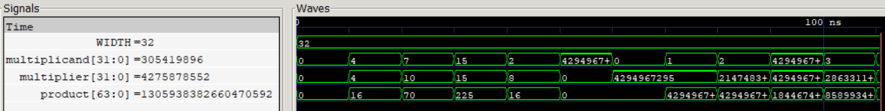

# Braun Array Multiplier (BAM)
A 32-bit combinational Braun Array Multiplier implementing unsigned 32-bit × 32-bit multiplication using a regular array of partial products and half/full adders.
The multiplier generates 1024 partial products using AND operations and reduces them through a structured HA/FA array to produce a 64-bit product in a single combinational operation.
The implementation was characterized using the `Sky130 HD` standard-cell library and verified through RTL simulation and gate-level simulation.

  
   
  32-Bit Braun Array Multiplication

## Features

- 32-bit × 32-bit unsigned multiplication
- Combinational Braun array architecture
- 1024 partial products
- 32 half adders
- 960 full adders
- 64-bit product
- Single-cycle combinational operation
- Synthesizable SystemVerilog
- RTL simulation and GLS verified

## Synthesis Results

Technology: Sky130 HD  
Tool: Yosys

| Metric | Braun Array Multiplier |
|---|---|
| Width | 32 × 32-bit |
| Product Width | 64-bit |
| Area | 36198.4672 µm² |

## Static Timing Analysis

| Metric | Braun Array Multiplier |
|---|---|
| Critical Path | 34.28 ns |
| Estimated Fmax | ~29.17 MHz |

## Power

| Metric | Braun Array Multiplier |
|---|---|
| Total Power | 523 mW |
| Internal Power | 353 mW |
| Switching Power | 170 mW |
| Leakage Power | ~18.2 nW |

## PPA Analysis

| Architecture | Area (µm²) | Critical Path (ns) | Estimated Fmax | Power (mW) | ADP (µm²·ns) | PDP (mW·ns) |
|---|--- |--- |--- |--- |--- |--- |
| Braun Array Multiplier | 36198.4672 | 34.28 | ~29.17 MHz | 523 | 1240883.06 | 1793.67 |
