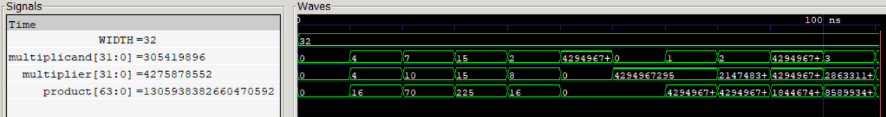

# Dadda Tree Multiplier (DTM)

The Dadda Tree reduces the 32 × 32 partial-product matrix through a sequence of reduction stages with carefully selected target heights, using Half Adders (HA) and Full Adders (FA) to reduce the matrix to two 
final rows.

Two implementations use different final carry-propagate adders: a 64-bit Ripple-Carry Adder (RCA) and a 64-bit Kogge-Stone Adder (KSA), allowing the impact of parallel-prefix carry computation on multiplier 
PPA and timing to be characterized.

  
   
  32-Bit Dadda Tree Multiplication

## Features

- 32-bit × 32-bit unsigned multiplication
- Combinational Dadda Tree architecture
- 1024 partial products
- Multi-stage HA/FA partial-product reduction
- Dadda reduction target heights: 28 → 19 → 13 → 9 → 6 → 4 → 3 → 2
- 64-bit product

## Synthesis Results

Technology: Sky130 HD  
Tool: Yosys

| Metric | Dadda + RCA | Dadda + KSA |
|---|---|---|
| Width | 32 × 32-bit | 32 × 32-bit |
| Product Width | 64-bit | 64-bit |
| Area | 32029.4688 µm² | 40322.4224 µm² |

## Static Timing Analysis

| Metric | Dadda + RCA | Dadda + KSA |
|---|---|---|
| Critical Path | 16.12 ns | 5.65 ns |
| Estimated Fmax | ~62.03 MHz | ~176.99 MHz |

## Power

| Metric | Dadda + RCA | Dadda + KSA |
|---|---|---|
| Total Power | 113 mW | 154 mW |

## Latency & Throughput

| Metric | Dadda + RCA | Dadda + KSA |
|---|---|---|
| Cycles / Multiplication | 1 | 1 |
| Critical Path | 16.12 ns | 5.65 ns |
| Estimated Fmax | ~62.03 MHz | ~176.99 MHz |
| Latency / Multiplication | 16.12 ns | 5.65 ns |
| Throughput | ~62.03 M/s | ~176.99 M/s |
