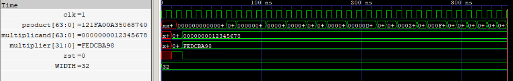

# Shift-and-Add Multiplier (SHA)
A 32-bit iterative Shift-and-Add multiplier implementing unsigned 32-bit × 32-bit multiplication over 32 clock cycles.

The baseline implementation uses the synthesizer-inferred adder from the RTL `+` operator. A second implementation replaces the accumulation adder with a 64-bit `Kogge-Stone Adder (KSA)` 
to characterize the impact of parallel-prefix carry computation on multiplier PPA and timing.

Both implementations were verified through RTL simulation and gate-level simulation.

  
   
  32-Bit Multiplication

## Features

- 32-bit × 32-bit unsigned multiplication
- Iterative shift-and-add architecture
- 64-bit product
- 32 clock-cycle execution
- Synthesizable SystemVerilog
- RTL simulation and GLS verified

## Synthesis Results

Technology: Sky130 HD  
Tool: Yosys

| Metric | Shift-and-Add (+) | Shift-and-Add (KSA) |
|---|---|---|
| Width | 32 × 32-bit | 32 × 32-bit |
| Product Width | 64-bit | 64-bit |
| Area | 7782.464 µm² | 9266.3872 µm² |

## Static Timing Analysis

| Metric | Shift-and-Add (+) | Shift-and-Add (KSA) |
|---|---|---|
| Critical Path | 24.95 ns | 6.20 ns |
| Estimated Fmax | ~40.08 MHz | ~161.3 MHz |
| Slack @ 10 ns | -15.04 ns | +3.71 ns |

## Power

| Metric | Shift-and-Add (+) | Shift-and-Add (KSA) |
|---|--- |--- |
| Total Power | 793 µW | 807 µW |

## PPA Analysis

| Architecture | Area (µm²) | Critical Path (ns) | Estimated Fmax | Power (µW) | ADP (µm²·ns) | PDP (µW·ns) |
|---|---|---|---|---|---|---|
| Shift-and-Add (+) | 7782.464 | 24.95 | ~40.08 MHz | 793 | 194272.49 | 19785.35 |
| Shift-and-Add (KSA) | 9266.3872 | 6.20 | ~161.3 MHz | 807 | 57449.60 | 5003.40 |
