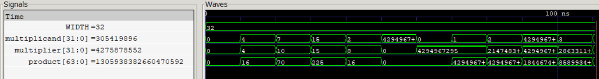

# Wallace Tree Multiplier (WTM)
A 32-bit combinational Wallace Tree multiplier implementing unsigned 32-bit × 32-bit multiplication using a multi-stage partial-product reduction tree.
The Wallace Tree reduces the 32 × 32 partial-product matrix through successive Half Adder (HA) and Full Adder (FA) compression stages to produce two final rows.
Two implementations use different final carry-propagate adders: a 64-bit Ripple-Carry Adder (RCA) and a 64-bit Kogge-Stone Adder (KSA), allowing the impact of parallel-prefix carry 
computation on multiplier PPA and timing to be characterized.

  
   
  32-Bit Wallace Tree Multiplication

## Features

- 32-bit × 32-bit unsigned multiplication
- Combinational Wallace Tree architecture
- 1024 partial products
- Multi-stage HA/FA partial-product reduction
- 64-bit product
- 64-bit final carry-propagate adder
- RCA and KSA final-adder implementations

## Synthesis Results

Technology: Sky130 HD  
Tool: Yosys

| Metric | Wallace + RCA | Wallace + KSA |
|---|--- |--- |
| Width | 32 × 32-bit | 32 × 32-bit |
| Product Width | 64-bit | 64-bit |
| Area | 31911.856 µm² | 31639.0944 µm² |

## Static Timing Analysis

| Metric | Wallace + RCA | Wallace + KSA |
|---|---|---|
| Critical Path | 18.53 ns | 15.25 ns |
| Estimated Fmax | ~53.97 MHz | ~65.57 MHz |

## Power

| Metric | Wallace + RCA | Wallace + KSA |
|---|---|---|
| Total Power | 117 mW | 115 mW |

## Latency & Throughput

| Metric | Wallace + RCA | Wallace + KSA |
|---|--- |--- |
| Cycles / Multiplication | 1 | 1 |
| Critical Path | 18.53 ns | 15.25 ns |
| Estimated Fmax | ~53.97 MHz | ~65.57 MHz |
| Latency / Multiplication | 18.53 ns | 15.25 ns |
| Throughput | ~53.97 M/s | ~65.57 M/s |

## PPA Analysis

| Architecture | Area (µm²) | Critical Path (ns) | Estimated Fmax | Power (µW) | ADP (µm²·ns) | PDP (µW·ns) |
|---|---|---|---|---|---|---|
| Wallace + RCA | 31911.856 | 18.53 | ~53.97 MHz | 117000 | 591327.49 | 2163965.68 |
| Wallace + KSA | 31639.0944 | 15.25 | ~65.57 MHz | 115000 | 482195.69 | 1757127.50 |

## Relative Comparison

| Architecture | Area vs RCA | Fmax vs RCA | Power vs RCA | Latency vs RCA | Throughput vs RCA | ADP vs RCA | PDP vs RCA |
|---|---|---|---|---|---|---|---|
| Wallace + RCA | 1.00× | 1.00× | 1.00× | 1.00× | 1.00× | 1.00× | 1.00× |
| Wallace + KSA | 0.99× | 1.21× | 0.98× | 0.82× | 1.21× | 0.82× | 0.81× |

1FA00A35068740
